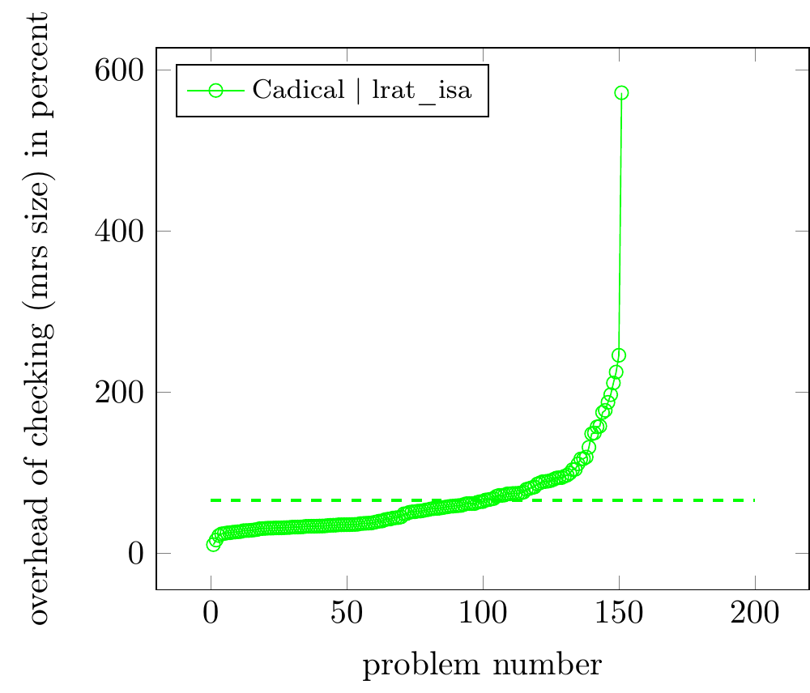

# Plots generated from our Benchmarks

## CDFs for Checking in Parallel to solving

For the 151 SC2022 main track problems that CaDiCaL could solve within 5000s timeout on our machine

## Time Overhead for Checking

Observed run-time overhead for checking the certificate, as compared to just running CaDiCaL without certificate generation

## Memory Overhead for Checking

Peak-memory usage overhead for checking the certificate, as compared to just running CaDiCaL without certificate generation. Note that we did not include cake_lpr in this comparison, as it requires setting a maximum heap size upfront, and is likely to completely use all available memory. As, in streaming mode, we cannot make educated guesses about the required memory, we used 16GiB heap size. This yielded very high overheads for many smaller problems, but still memouted for 6 problems in our test set.

